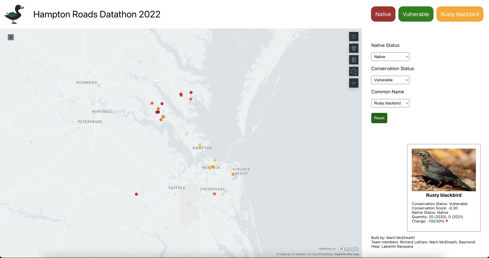
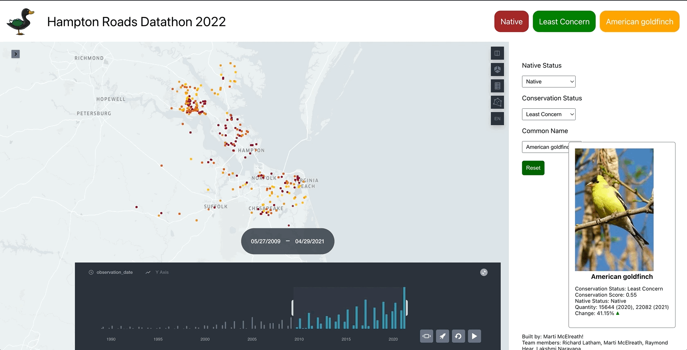

# Hackathon for Biodiversity
This repo contains some data cleaning scripts, data dumps, and assets for the first Hampton Roads Datathon from September 9 to September 16, 2022. The [hackathon](https://www.eventbrite.com/e/hampton-roads-datathon-tickets-385845453137) was hosted by [Slover Library](https://www.sloverlibrary.com/) in Norfolk, Virginia. The theme of the hackathon was "Analyzing, Promoting, and Protecting Biodiversity in Hampton Roads".

## Website
We developed a web application using React component [kepler.gl](kepler.gl) to show trends in bird distribution throughout the Hampton Roads region.

## Presentation
The following [presentation](assets/presentation.pdf) was given alongside the web application demonstration.

## Data
We used data from the [FeederWatch raw dataset](https://feederwatch.org/explore/raw-dataset-requests/), information on native birds from the [Virginia Society of Ornithology](https://www.virginiabirds.org/offical-state-checklist), and images from [Wikimedia Commons](https://commons.wikimedia.org/wiki/Main_Page).

## Contact
Feel free to contact [Richard Latham](mailto:richardelatham@gmail.com) for further information.

This was a team effort! The team consisted of: Marti McElreath (web application developer), Raymond Hear (data cleaning and presentation development), Lakshmi Narayana (data cleaning and presentation), Richard Latham (data cleaning and presentation development).