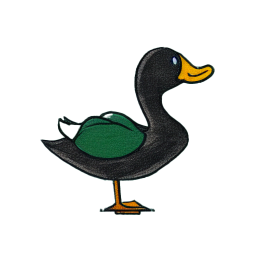

# Hackathon for Biodiversity
This repo contains some data cleaning scripts, data dumps, and assets for the first Hampton Roads Datathon from September 9 to September 16, 2022. The [hackathon](https://www.eventbrite.com/e/hampton-roads-datathon-tickets-385845453137) was hosted by [Slover Library](https://www.sloverlibrary.com/) in Norfolk, Virginia. The theme of the hackathon was "Analyzing, Promoting, and Protecting Biodiversity in Hampton Roads".

## Website
We developed a web application using React component [kepler.gl](kepler.gl) to show trends in bird distribution throughout the Hampton Roads region.

## Presentation
The following [presentation](assets/presentation.pdf) was given alongside the web application demonstration.

## Data
We used data from the [FeederWatch raw dataset](https://feederwatch.org/explore/raw-dataset-requests/), information on native birds from the [Virginia Society of Ornithology](https://www.virginiabirds.org/offical-state-checklist), and images from [Wikimedia Commons](https://commons.wikimedia.org/wiki/Main_Page).

## Scripts

### Data cleaning 

- [FeederWatch](scripts_cleaning/clean_feederwatch.R)
> This script reduced the raw dataset of Feederwatch into a state of VA and Hampton Roads dataset. Apache Arrow (parquet) is used to compress output file size. The final `out_data.csv` is used in webapp.

- FIA Data
> (Data not used) The [pull_fia_data.R](scripts_cleaning/pull_fia_data.R) script pulls data from FIA. It's a workaround given FIA had website issues circa Sept 2022. [main_fia.py](scripts_cleaning/main_fia.py) outputs cleaned data into a form usable for mapping.

- [VA Birds](scripts_cleaning/clean_vabirds.R)
> This script was to clean the list of VA birds and assign a "native" or "non native" class.

- [VA Conservation](scripts_cleaning/clean_vaconservation.R)
> (Data not used) This script was to clean the VA Conservation data into 

### Analysis

- Bird's Eye Stats
> [hamptonroads_stats.R](analysis/hamptonroads_stats.R) - calculate misc statistics for presentation on land coverage.

- iNaturalist density by city
> (Data not used) Look at density of birds by city/county with two scripts: [inaturalist_data_density.py](analysis/inaturalist_data_density.py) and [inaturalist_data.ipynb](analysis/inaturalist_data.ipynb).

- Summarize bird details
> [summarize_bird_stats.R](analysis/summarize_bird_stats.R) calculates year-over-year trend information and calculates a 'conservation score' reflecting the regional data. [summarize_vabird_dets.R](analysis/summarize_bird_dets.R) pulls image/description from Wikipedia, integrates detail on nativity, and the statistics of each species into one dataframe. Exports as `out_infobox.csv` for webapp.

## Logo
We made our beautiful logo using [Stable Diffusion](https://github.com/CompVis/stable-diffusion). Introducing Mr. Mallard.

## Contact
Feel free to contact [Richard Latham](mailto:richardelatham@gmail.com) for further information.

This was a team effort! The team consisted of: Marti McElreath (web application developer), Raymond Hear (data cleaning and presentation development), Lakshmi Podagatlapalli (data cleaning and presentation), Richard Latham (data cleaning and presentation development).
